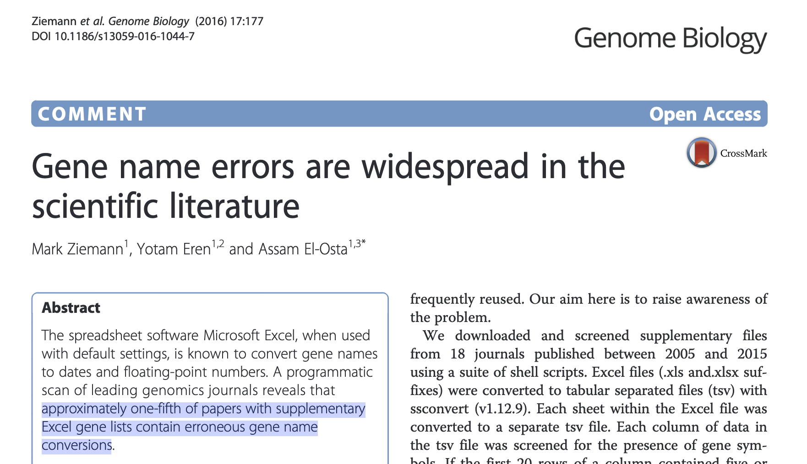
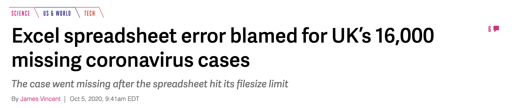
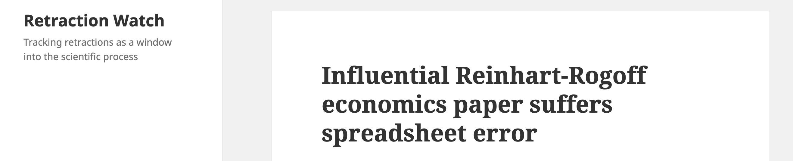
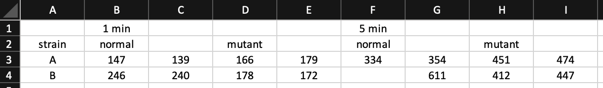
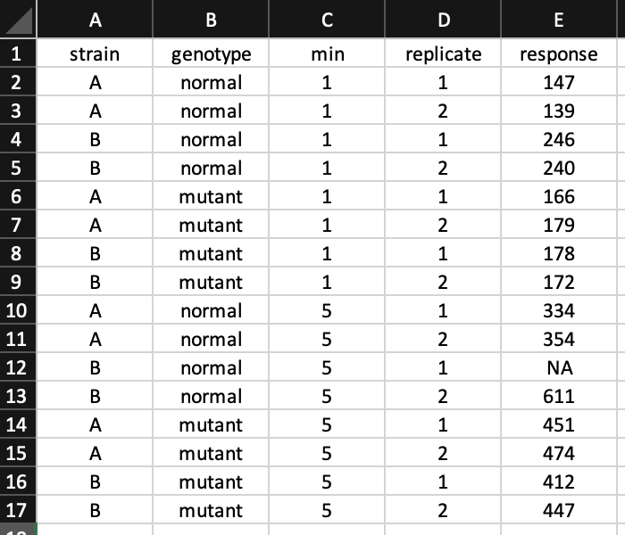
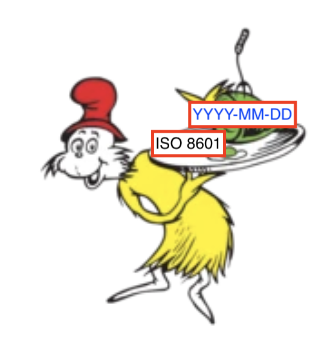
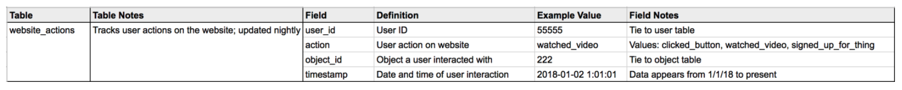

```{r xaringan-themer, include=FALSE, warning=FALSE}
library(xaringanthemer)
# the two PCCTC colors are #0085ca and #62b5e5
# complement of #62b5e5 is #e59262
# #d362e5 is a tertiary
style_duo_accent(
  primary_color = "#62b5e5",
  secondary_color = "#e59262",
  colors = list(
    blue = "#62b5e5",
    orange = "#e59262",
    white = "#ffffff",
    purple = "#d362e5",
    darkblue = "#0085ca"
  ),
  extra_fonts = list(google_font("Raleway"))
)
```

class: title-slide-custom

## Data Sharing and Organization

### Travis Gerke, ScD

<!--
Photo by <a href="https://unsplash.com/@nananadolgo?utm_source=unsplash&utm_medium=referral&utm_content=creditCopyText">Nana Smirnova</a> on <a href="https://unsplash.com/s/photos/data?utm_source=unsplash&utm_medium=referral&utm_content=creditCopyText">Unsplash</a>
-->

---

## What we're going to talk about

* Entering data into spreadsheets **.orange[the right way]**
  * [Data Organization in Spreadsheets](https://www.tandfonline.com/doi/full/10.1080/00031305.2017.1375989) (Broman & Woo, 2018)
  * [Tidy Data](https://www.jstatsoft.org/article/view/v059i10) (Wickham, 2014)
  * [How to Name Files](https://rstats.wtf/how-to-name-files.html) (Bryan, 2015)
<!-- 
also slides 49-61 at
https://rstudio-conf-2020.github.io/what-they-forgot/materials/project-oriented-workflow.pdf
-->

* Sharing **.orange[analysis-ready]** data with collaborators 
  * [How to Share Data for Collaboration](https://www.ncbi.nlm.nih.gov/pmc/articles/PMC7518408/pdf/nihms-1502431.pdf) (Ellis & Leek, 2018)
  * [Column Names as Contracts](https://emilyriederer.netlify.app/post/column-name-contracts/) (Riederer, 2020)
  * [Field Notes: Building Data Dictionaries](https://caitlinhudon.com/2018/10/30/data-dictionaries/) (Hudon, 2018)

* I will provide **7 rules** which summarize the above resources to help you

---
class: blue-bg, center, middle

## .white[Spreadsheet] .orange[horror] .white[stories]

---
class: center, middle



---
class: center, middle


---
class: center, middle



--
<hr>



--
<hr>


---
class: blue-bg, center, middle

.small-rule[RULE 1:]
## .white[Make tidy data]

---
class: highlight-last-item

## How to make tidy data

1. Each variable forms a column

--

2. Each observation of that variable forms a row

--

3. Each "kind" of data gets its own table

--

4. When there are multiple tables, each table has a common column with another table that allows merging

--

<br><br><br>
> Tidy datasets are all alike, but every messy dataset is messy in its own way. 
.right[-Wickham]

---
class: highlight-last-item

## Make data rectangular

Often aiming for a proper rectangle is a good way to get to tidy data

Things that are not represented as a cell in the rectangle will cause problems (including blanks)!

--

- No empty cells (often used to imply data)

  - Use `NA` or `-` to show missingness (more on this later)

--

- Only one row for a column header

--

- No data represented as cell/font colors

---
**Untidy** &#x1F625;
.w-90[

]

**Tidy** &#x1F604;
.w-50[

]

---
class: blue-bg, center, middle

.small-rule[RULE 2:]
## .white[Choose column names that humans] .orange[and] .white[machines will understand]

---
## Choose column names that humans **.orange[and]** machines will understand

* Humans like words or long abbreviations

  * **.orange[Good:]** `baseline_tumor_size`, `dt_salvage_chemo`
  * **.orange[Bad:]** `ts0`, `d_sal_ch`

--

* Computers don't like spaces and special characters (except `-` and `_`)

  * `$` `@` `%` `#` `&` `*` `,` `!` `/` have special meanings in programming
  * Consistently use only one of `-` or `_`
  * **.orange[Good:]** `sex`, `weight`
  * **.orange[Bad:]** `M/F`, `wgt.`

---
## Treat column names as contracts

Name variables according to a consistent heirarchy, so that users (and machines) can tell from the name what to expect

--

**.orange[Level 1.]** Measure types
  * `id` (identifier), `ind` (indicator), `n` (count), `dt` (date), `amt` (real number amount), `cat` (categorical)

--

**.orange[Level 2.]** Measure subjects
  * `patient` (info about patient), `visit` (info about a visit), `lab` (info about a lab)

--
  
**.orange[Level 3+.]** Details
  * `race`, `cost`, `psa`

<br>

--
<hr> 

Resulting names: `id_patient`, `dt_visit`, `amt_lab_psa`, `cat_patient_race`

---
class: blue-bg, center, middle

.small-rule[RULE 3:]
## .white[Name files as carefully as columns, and make sure they sort properly]

---
## File naming

* Avoid spaces and special characters (except `-` and `_`)
* Use `-` and `_` strategically
  * Hyphens to separate words, underscores to separate categories
* Pad single digits with leading `0`s
* **.orange[Good:]** 
  * `01_bayerproj_data-prep.R`
  * `02_bayerproj_survival-analysis.R`
  * `2021-03-27_bayerproj_KM-curves.pdf`
  * `2021-04-19_bayerproj_KM-curves.pdf`
  
* **.orange[Bad:]**
  * `dataprep.R`
  * `survival analysis for bayer (1) final.R`
  * `output (finalTG).pdf`
  * `output (finalTG)final.pdf`

---
class: blue-bg, center, middle

.small-rule[RULE 4:]
## .white[Use ISO 8601 dates]

---
## Always use ISO 8601: YYYY-MM-DD

* This is the only date format that will sort appropriately

* A+ trick: you can (and should) turn off Excel's automatic date coversion behavior by:
  1. Select a column
  2. In the menu, go to Format &rarr; Cells
  3. Select `Text` as the Category

--

* Use 8601 when naming files, use 8601 when entering data, use 8601...

.h-center.w-50[

]

---
class: blue-bg, center, middle

.small-rule[RULE 5:]
## .white[Enter values consistently]

---
class: highlight-last-item

## Enter values consistently

* Occasional abbreviations: don't
  
  * `Male` &ne; `M`

--

* Case matters

  * `Male` &ne; `male`

--

* White space matters

  * `Male` &ne; <span style="background-color: #e8e8e8">&nbsp;</span>`Male`

--

* Always use consistent missing values!

  * **.orange[Good:]** `NA` or `-`

  * **.orange[Bad:]** `999`, explanatory notes about missingness (ok as a separate column)

---
class: blue-bg, center, middle

.small-rule[RULE 6:]
## .white[Save raw data and calculated/derived data as separate tables]

---
## A tale of two tables

1. **.orange[The raw data]**
  
  * Often some untidy mess sent by a vendor, well-meaning collaborator

  * NEVER CHANGE THIS FILE
  
  * Properties of raw data: **(1)** have not been manipulated by software or humans, **(2)** no data have been removed, **(3)** no data have been summarized
    
2. **.orange[The tidy / analysis-ready / summarized data]**

  * You took the raw data, and made it useful. All of those steps DID NOT HAPPEN in the raw table; rather you made a copy, and arrived at this table
  
  * Likely operations: renaming columns, recoding missing variables, deriving new variables which are combinations of others
  
--

  * Which brings me to the last rule...

---
class: blue-bg, center, middle

.small-rule[RULE 7:]
## .white[Make a data dictionary]

---
## Make a data dictionary

What this should typically incude (adapted from [Caitin Hudon](https://caitlinhudon.com/2018/10/30/data-dictionaries/)): 

* **.orange[Table:]** the table name (name of spreadsheet or tab), exactly the way it appears
* **.orange[Table Notes:]** general notes on the table, like the theme of the data in the table, how often it gets updated, and where it comes from
* **.orange[Field:]** the field name, exactly as it appears in the data
* **.orange[Definition:]** a user-friendly (often long-form) definition of the field. _For derived variables, describes the exact steps you took to get from raw to derived_
* **.orange[Example value:]** used to show what data in that field actually looks like
* **.orange[Field notes:]** general notes on the field, sometimes including values, caveats or notes of interest, and places (like tables) to find more information about that field

.h-center[

]

---
class: blue-bg, center, middle

## .white[Final remarks]

---
## A general rule of thumb

Imagine you are sending data to your future self, and your future self has no memory of the source or context surrounding these data. Ask two questions:

> **(1)** Would future you be able to efficiently figure out (_without asking anyone for help_) how to produce insights from the data?

> **(2)** Would future you be able to explain why you are confident that the insights you produce are accurate?

If the answer is "no / not sure," it's very likely that one of the seven rules has not been followed.

--
<hr>

  * [Data Organization in Spreadsheets](https://www.tandfonline.com/doi/full/10.1080/00031305.2017.1375989) (Broman & Woo, 2018)
  * [Tidy Data](https://www.jstatsoft.org/article/view/v059i10) (Wickham, 2014)
  * [How to Name Files](https://rstats.wtf/how-to-name-files.html) (Bryan, 2015)
  * [How to Share Data for Collaboration](https://www.ncbi.nlm.nih.gov/pmc/articles/PMC7518408/pdf/nihms-1502431.pdf) (Ellis & Leek, 2018)
  * [Column Names as Contracts](https://emilyriederer.netlify.app/post/column-name-contracts/) (Riederer, 2020)
  * [Field Notes: Building Data Dictionaries](https://caitlinhudon.com/2018/10/30/data-dictionaries/) (Hudon, 2018)


<!-- tip for title css from
https://stackoverflow.com/questions/64269808/is-it-possible-to-adjust-background-image-opacity-in-a-xaringan-slideshow
-->

```{css, echo = FALSE}
.title-slide-custom {
  position: relative;
  z-index: 1;
}
.title-slide-custom h2 {
  font-size: 1.3em;
  position: absolute;
  bottom: 3%;
  left: 2%;
}
.title-slide-custom h3 {
  font-size: .75em;
  color: var(--orange);
  position: absolute;
  bottom: 0%;
  left: 2%;
}
.title-slide-custom::before {    
      content: "";
      background-image: url('images/nana-smirnova-IEiAmhXehwE-unsplash.jpg');
      background-size: cover;
      position: absolute;
      top: 0px;
      right: 0px;
      bottom: 0px;
      left: 0px;
      opacity: 0.7;
      z-index: -1;
}
.title-slide-custom .remark-slide-number {
  display: none;
}
.blue-bg {
  background-color: var(--blue);
}
.h-center {
  margin: 0 auto;
}
.w-90 {
  width: 90%;
}
.w-50 {
  width: 50%;
}
.small-rule{
  font-size: 1em;
  font-weight: bold;
  color: var(--darkblue);
}

.highlight-last-item > ul > li, 
.highlight-last-item > ol > li {
  opacity: 0.5;
  color: var(--orange);
}
.highlight-last-item > ul > li:last-of-type,
.highlight-last-item > ol > li:last-of-type {
  opacity: 1;
  font-weight: bold;
}
```
